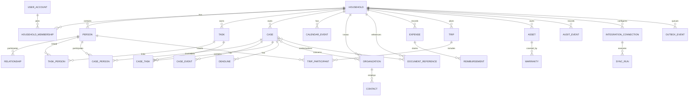

# ERD

### Context links

`CASE }o--o{ DOCUMENT_REFERENCE` is implemented by a single generic
`record_link` table rather than a join table per pair — the same need
applies to expenses, trips, assets, tasks and claims, and twenty-one join
tables would be twenty-one authorization paths. See ADR-021; the rule that
matters is that a link is visible only if the actor may read the record at
the *other* end.

### Database constraints

- every household-owned row has a non-null householdId
- foreign keys are explicit
- unique constraints exist for provider + externalId
- state transitions are enforced in application commands and tested
- timestamps use UTC
- date-only fields use DATE
- monetary values use integer minor units + ISO currency
- no cascade delete across audit history
